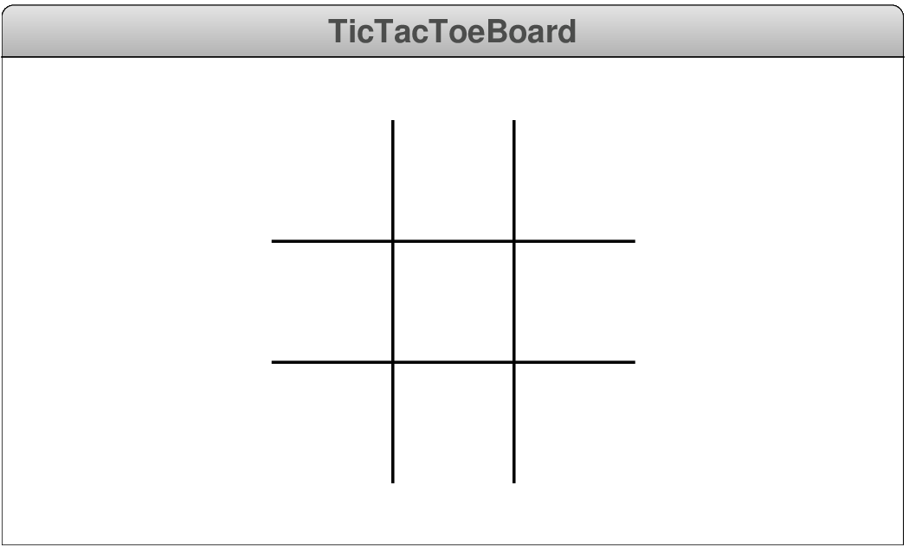

## The Classic Game
- Write a graphical program `TicTacToeBoard.py` that draws a Tic-Tac-Toe board centered in the graphics window, as shown in the following image:
  
  {width=50%}

  The size of the board should be specified as a constant, and the diagram should be centered in the window, both horizontally and vertically.


## Coordinate Calculations
- One of the problems that people often have is calculating the coordinates for each `GObject` on the screen given the constants provided in the template.

::::::cols
::::{.col style='flex-grow:1.2'}
:::{style='font-size:.8em'}
<ul>
  <li class='fragment' data-fragment-index=1>Here are some useful steps:</li>
  <ul>
    <li class='fragment' data-fragment-index=2>Find a sheet of graph paper</li>
    <li class='fragment' data-fragment-index=3>Draw the figure you want</li>
    <li class='fragment' data-fragment-index=4>Compute the coordinates of the center of the window</li>
    <li class='fragment' data-fragment-index=5>Compute the coordinates of each point in terms of defined constants and the center</li>
    <ul>
      <li class='fragment' data-fragment-index=6>The <em>x</em> coordinate of the first vertical line is shifted left by one-sixth of the board size</li>
      <li class='fragment' data-fragment-index=7>The <em>y</em> coordinate of that line is shifted up by half the size of the board</li>
    </ul>
  </ul>
</ul>
:::
::::

::::col


::::
::::::


## Tic-Tac-Solution
```{.mypython style='font-size:.8em; max-height:800px'}
# File: TicTacToeBoard.py

"""
This program draws a Tic-Tac-Toe board in the center of the
graphics window.
"""

from pgl import GWindow, GLine

# Constants

GWINDOW_WIDTH = 500
GWINDOW_HEIGHT = 300
BOARD_SIZE = 240

# Main program

def tic_tac_toe_board():
    """
    Draws a Tic-Tac-Toe board.  The program centers the board
    on the window and computes the coordinates of the lines
    from the constant BOARD_SIZE.
    """
    gw = GWindow(GWINDOW_WIDTH, GWINDOW_HEIGHT)
    cx = gw.get_width() / 2
    cy = gw.get_height() / 2
    half = BOARD_SIZE / 2
    sixth = BOARD_SIZE / 6
    gw.add(GLine(cx - half, cy - sixth, cx + half, cy - sixth))
    gw.add(GLine(cx - half, cy + sixth, cx + half, cy + sixth))
    gw.add(GLine(cx - sixth, cy - half, cx - sixth, cy + half))
    gw.add(GLine(cx + sixth, cy - half, cx + sixth, cy + half))

# Startup code

if __name__ == "__main__":
    tic_tac_toe_board()
```

## Midterm 1 Review
- The rest of section slides go through the solutions to the first practice midterm so that you can see how to approach these problems.
- The actual Midterm 1 will have the same number of questions, each with the same topics.


## Practice Midterm 1: Problem 1a


## Practice Midterm 1: Problem 1b


## Practice Midterm 1: Problem 1c


## Practice Midterm 1: Problem 2 {data-state="MysteryTrace"}
<table id="MysteryTable">
<tbody style="border:none;">
<tr><td><div id="MysteryTrace" style="margin:0px;"></div></td></tr>
<tr><td>
<div id="MysteryBanner" style="margin:0px; padding:0px;">Console</div>
</td></tr>
<tr><td><div id="MysteryConsole"></div></td></tr>
<tr>
<td style="text-align:center;">
<table class="CTControlStrip">
<tbody>
<tr>
<td>

</td>
<td>

</td>
</tr>
</tbody>
</table>
</td>
</tr>
</table>

## Practice Midterm 1: Problem 3
One approach might look like:

```mypython
def sum_odds(N):
    total = 0
    for i in range(1, 2*N, 2):
        total += i
    return total
```

## Practice Midterm 1: Problem 4

```mypython
def remove_dups(word):
    new = ""
    for i in range(len(word)):
        if not (i > 0 and word[i] == word[i-1]):
            new += word[i]
    return new
```


## Practice Midterm 2: Problem 1a


## Practice Midterm 2: Problem 1b


## Practice Midterm 2: Problem 1c


## Practice Midterm 2: Problem 2 {data-state="Mystery2Trace"}
<table id="Mystery2Table">
<tbody style="border:none;">
<tr><td><div id="Mystery2Trace" style="margin:0px;"></div></td></tr>
<tr><td>
<div id="Mystery2Banner" style="margin:0px; padding:0px;">Console</div>
</td></tr>
<tr><td><div id="Mystery2Console"></div></td></tr>
<tr>
<td style="text-align:center;">
<table class="CTControlStrip">
<tbody>
<tr>
<td>

</td>
<td>

</td>
</tr>
</tbody>
</table>
</td>
</tr>
</table>


## Practice Midterm 2: Problem 3
- We need to be checking all possibilities between two different values, which would imply nested loops
- One approach might look like:
```mypython
def perfect_squares(N):
    count = 0
    for a in range(N):
        for b in range(N):
            if a ** 2 + b ** 2 == N ** 2:
                print(f"A={A}, B={b}")
                count += 1
    return count
```

## Practice Midterm 2: Problem 4
- This is mostly just practicing conditional statements and string operations to check the needed constraints
- One solution:
```mypython
def create_regular_plural(word):
    if ( word[-1] in "sxz" or 
         word[-2:] == "ch" or word[-2:] == "sh"
       ): # Condition 1
        return word + "es"
    elif word[-1] == "y" and word[-2] not in "aeiou": # C2
        return word[:-1] + "ies"
    else: # Condition 3 (all else)
        return word + "s"
```
